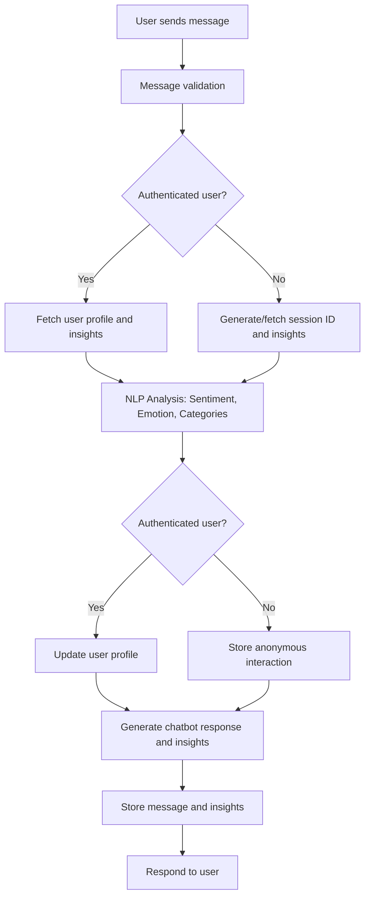

# Project Overview

This project is a Django-based application that integrates three main modules:
1. **Chatbot**: Implements a conversational chatbot with personalized responses and insights.
2. **Accounts**: Manages user authentication and registration.
3. **Frontend**: Provides the user interface for interacting with the chatbot and managing user sessions.

---

## Folder Structure and Functionality

### **1. Chatbot Folder**
The `chatbot` folder contains all components related to the chatbot functionality.

#### **Key Components**
- **`llama.py`**:
  - Handles interactions with an external chatbot API hosted locally (`http://localhost:11434/api/chat`).
  - Generates:
    - **Chatbot Responses**: Based on user messages.
    - **Insights**: Statements about the user using past interactions and current input.
  - Categorizes insights into themes like "Productivity," "Health," and "Relationships."

- **`views.py`**:
  - **`ChatbotView`**:
    - Processes user messages and performs:
      - Sentiment and emotion analysis using pre-trained NLP models.
      - Updates user profiles with personality traits and interaction patterns.
      - Generates chatbot responses and user insights using the `LLaMA` class.
    - Handles both authenticated and anonymous users.
  - **`MessagesView`**:
    - Provides an endpoint to retrieve all chatbot messages for authenticated users.

#### **Chatbot Process Flow**
Below is the process flow for the chatbot's functionality:



---

### **2. Accounts Folder**
The `accounts` folder manages user authentication and registration.

#### **Key Components**
- **`models.py`**:
  - Defines a custom user model (`CustomUser`) extending Django's base user model.
  - Attributes include `username`, `is_active`, and `is_staff`.
  - Managed by `CustomUserManager` for creating users and superusers.

- **`serializers.py`**:
  - Serializes user data for API communication.
  - Includes the `UserSerializer` for `CustomUser` data (fields: `id`, `username`).

- **`views.py`**:
  - **`RegisterView`**:
    - Handles user registration with a unique username and password.
  - **`LoginView`**:
    - Authenticates users and issues JWT tokens for secure sessions.

---

### **3. Frontend Folder**
The `chatapp` folder contains the React-based frontend implementation, providing a user-friendly interface for interacting with the chatbot and managing user sessions.

#### **Components Folder**
- **Path**: `chatapp/src/components`
- **Files**:
  - [`ChatWindow.jsx`](https://github.com/Kuhmpel/poc/blob/main/chatapp/src/components/ChatWindow.jsx): Implements the main chat window user interface, allowing interaction with the chatbot.
  - [`Login.jsx`](https://github.com/Kuhmpel/poc/blob/main/chatapp/src/components/Login.jsx): Provides a login form for user authentication.
  - [`Register.jsx`](https://github.com/Kuhmpel/poc/blob/main/chatapp/src/components/Register.jsx): Provides a registration form for creating new user accounts.

#### **Context Folder**
- **Path**: `chatapp/src/context`
- **Files**:
  - [`AuthContext.jsx`](https://github.com/Kuhmpel/poc/blob/main/chatapp/src/context/AuthContext.jsx): Manages user authentication state across the application and provides session data to components.

#### **Layout Folder**
- **Path**: `chatapp/src/layout`
- **Files**:
  - [`ChatGPTStyleLayout.css`](https://github.com/Kuhmpel/poc/blob/main/chatapp/src/layout/ChatGPTStyleLayout.css): Contains CSS styles for the chatbot interface, ensuring a user-friendly design.
  - [`ChatGPTStyleLayout.js`](https://github.com/Kuhmpel/poc/blob/main/chatapp/src/layout/ChatGPTStyleLayout.js): Implements the layout and structure for chatbot-related components, maintaining a consistent style.

---

## Summary of Functionalities

### **Chatbot Module**
- Provides personalized chatbot responses using NLP capabilities.
- Updates user profiles with insights, sentiment, and emotion data.
- Supports both authenticated and anonymous users.
- Categorizes user insights into themes like "Productivity" and "Health."

### **Accounts Module**
- Manages user registration and authentication.
- Implements a custom user model with extended attributes.
- Serializes user data for API interactions.
- Issues JWT tokens for secure user sessions.

### **Frontend Module**
- Implements a responsive user interface using React.
- Provides components for chatbot interaction, user login, and registration.
- Manages authentication state using context.
- Ensures consistent styling with custom layouts and CSS.

---

## How to Use

1. **Run the Application**:
   - Start the Django server:
     ```bash
     python manage.py runserver
     ```
   - Ensure the external chatbot API (`LLaMA`) is running at `http://localhost:11434`.

2. **Run the Frontend**:
   - Navigate to the `chatapp` directory:
     ```bash
     cd chatapp
     ```
   - Install dependencies and start the development server:
     ```bash
     npm install
     npm start
     ```

3. **Endpoints**:
   - **Chatbot**:
     - POST `/chatbot/`: Send user messages and receive chatbot responses.
     - GET `/chatbot/messages/`: Retrieve all chatbot messages (authenticated users only).
   - **Accounts**:
     - POST `/accounts/register/`: Register a new user.
     - POST `/accounts/login/`: Authenticate a user and retrieve JWT tokens.

---

## Future Enhancements
- Add more NLP models for enhanced emotion and sentiment analysis.
- Expand the chatbot's ability to handle complex queries and provide detailed responses.
- Integrate more themes for categorizing user insights.
- Enhance the frontend with additional features like dark mode and accessibility options.
